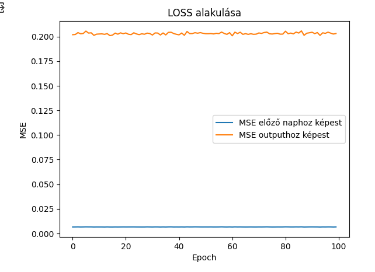
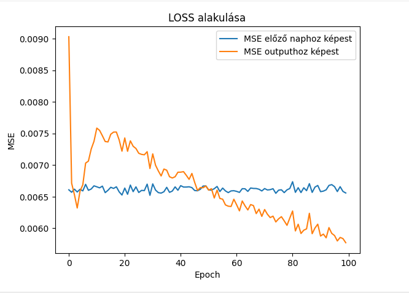
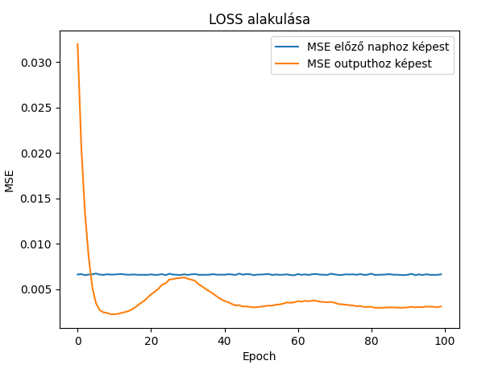
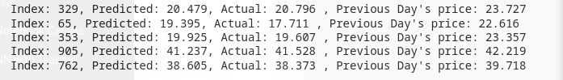
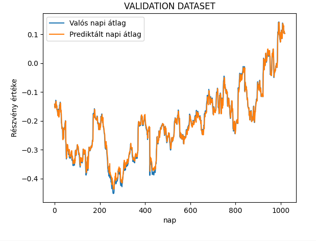

<<<<<<< HEAD
# AI-miniprojects
This is a repository of my miniprojects that I develop for work (public), school or for fun 
=======
# Recurrent Neural Network (RNN) Project

## Overview

This repository contains the code and resources for a Recurrent Neural Network (RNN) project. 
In my project I used financial data for Stock price predition, using 5 pharma stocks (Astra Zeneca, MERK, Novo Nordisk, Johnson & Johnson, Pfizer stocks) to give a prediction for
the next days average price. The data can be (and should be) changed accoring to the task you are trying to solve. The model architecture should also be upated according to your needs, 
(if you use more / other stocks you might have to change the parameters).
I included a Vanilla RNN, LSTM and a GRU architecture, feel free to choose!

## Table of Contents

- [Features](#features)
- [Getting Started](#getting-started)
- [Installation](#installation)
- [Usage](#usage)
- [Dataset](#dataset)
- [Model Architecture](#model-architecture)
- [Training](#training)
- [Evaluation](#evaluation)
- [Results](#results)
- [Contributing](#contributing)
- [License](#license)
- [Acknowledgments](#acknowledgments)

## Features

- Utilizes Recurrent Neural Networks for sequential data processing.
- Easy-to-use and well-documented codebase.
- Modularity for easy experimentation and extension.
- State-of-the-art performance on stock price prediction

## Getting Started

### Prerequisites

- Python 3.x
- Package dependencies: yfinance, pandas, sklearn, matplotlib, numpy, torch, copy, itertools

### Installation

1. Clone the repository:

   ```bash
   git clone https://github.com/your-username/your-rnn-project.git

### Usage

Once your trained your model you can use it on your input: (you can also plot it as I did here)

  ```python
  with torch.no_grad():
    predicted = model([Your data comes here]).numpy()
  plt.plot(predicted, label="Predicted values")
  plt.xlabel('Day')
  plt.ylabel('Average Daily Price')
  plt.legend()
  plt.show()
  ```

### Dataset

I gathered my data from yahoo finances yfinance API:

  ```python
  tickers = ["AZN", "MRK", "NVO", "JNJ", "PFE"]
  start_date= "1997-01-01"
  end_date = "2024-01-01"
  
  raw_data = pd.DataFrame()
  for ticker in tickers:
    data = yf.download(ticker, start = start_date, end = end_date)
    raw_data[ticker]= (data["Open"] + data["Close"] )/2
  ```


### Model Architecture

I included three types of commonly used architectures:

#### GRU 
The Gated Recurrent Unit (GRU) is a type of recurrent neural network (RNN) architecture designed to overcome the vanishing gradient problem in traditional RNNs. 
It uses update and reset gates to control the flow of information in and out of the hidden state, allowing it to selectively remember or forget information from previous time steps. 
This helps GRUs capture long-term dependencies in sequential data, making them effective for tasks like natural language processing. 
The key components are the update gate, reset gate, candidate hidden state, and the final hidden state, which is a combination of past and new information.

#### LSTM
Long Short-Term Memory (LSTM) is a type of recurrent neural network (RNN) architecture designed to address the vanishing gradient problem in traditional RNNs. 
LSTMs use memory cells and three gating mechanisms (input, forget, and output gates) to selectively store and retrieve information over long sequences. 
This allows LSTMs to capture and remember dependencies in sequential data, making them well-suited for tasks such as natural language processing, speech recognition,
and time-series prediction. The architecture enables LSTMs to handle long-term dependencies and mitigate issues with gradient vanishing during training.


#### Vanilla RNN
Vanilla Recurrent Neural Network (RNN) is a basic type of neural network designed for sequential data processing. 
It has a simple architecture with a hidden state that is updated at each time step based on the current input and the previous hidden state. 
However, Vanilla RNNs often face challenges with learning long-term dependencies due to the vanishing gradient problem. 
As a result, they may struggle to retain information from earlier time steps in the sequence. 
Despite their simplicity, Vanilla RNNs are less effective for tasks requiring the capture of long-range dependencies compared to more advanced architectures like LSTMs and GRUs.


### Training
I had the biggest success with the GRU model (as it is also the most advanced one). I recommend 100 epochs, with a hihger learning rate (0.001 or 0.01) as well as ADAM 
optimizer as it uses momentum with SGD. I also batched the computations which makes it faster, but it is not necessary. 

### Evaluation
As I predicted financial data, I used MSE as the loss funciton, however if you were to convert this to a N->N model or a classification task, you might have to use logistic loss, or crossentropy. 
I also fed the previous day's price (Teacher forcing) and the previous day's prediction back into my hidden state, so I also used a simple minimal benchmark that is I checked whether my predictions were better than 
substituting back the previous day's price. 

#### loss functions:

##### Vanilla RNN

##### LSTM

##### GRU


### Results

Results of the prediction:



Plotting the validation dataset:



### Contributing

Contributions are welcome! Please follow our contribution guidelines.
### License

This project is licensed under the MIT License - see the LICENSE.md file for details.

### Acknowledgments
- Neural Information Processing Systems (NeurIPS)
- Journal of Machine Learning Research (JMLR)
- Deep Learning" by Ian Goodfellow, Yoshua Bengio, and Aaron Courville
- Recurrent Neural Networks for Short-Term Load Forecasting: An Overview" by João P.S. Catalão
- ELTE university materials 

>>>>>>> master
